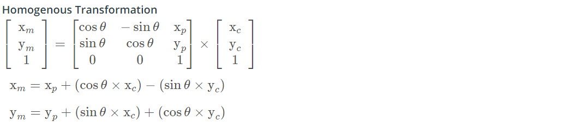

# Overview
This repository contains all the code needed to complete the final project for the Localization course in Udacity's Self-Driving Car Nanodegree.


## Project Introduction
Your robot has been kidnapped and transported to a new location! Luckily it has a map of this location, a (noisy) GPS estimate of its initial location, and lots of (noisy) sensor and control data.

In this project you will implement a 2 dimensional particle filter in C++. Your particle filter will be given a map and some initial localization information (analogous to what a GPS would provide). At each time step your filter will also get observation and control data.


## Localization Algorithm

Localization in case of self driving vehicle makes use of GPS, range sensors, landmark information and a global map based on the following algorithm given below:

1.
A global map of different areas is constructed, in which the self driving vehicle is to be deployed. This map contains information about different location of 'landmarks'. Landmarks are nothing but major features present in the locality, which are not subject to change for a longer period of time. Examples can be buildings, signal posts, intersections, etc. These landmarks are used in later steps to predict the relative location of car. These maps are updated often so as to add new features and refresh the locations of existing features.

2.
Once a map is constructed, GPS sensor installed inside the vehicle is used to predict the locality in which it is present. On basis of this locality, only a portion of global map is selected to avoid a large number of real time calculations as the algorithms must run in real time. As stated earlier, GPS sensor provides noisy measurement and hence cannot be used alone for localization.

3.
LIDAR and/or RADAR sensor installed on the vehicle then measure the distance between it and the landmarks around it. This helps in further pinning down location of the vehicle as it is now relative to landmarks in the global map constructed earlier. However, LIDAR and RADAR information is also not accurate and prone to noise. Hence, a sophisticated technique like Particle Filter is used.

4.
Particle Filter is used to combine the information gained from all above steps and predict the location of car with high accuracy of 3-10 cm.

The whole algorithm repeats at run time when the car is moving and new location of car is predicted.

## Project Implementation
Each major step involved in implementation is illustrated below:


The C++ program for localization was implemented using following major steps:

### 1. Initialization

In the initialization step the algorithm randomly generates N particles in the state space. If your position is completely unknown you would need a very large number of particles to cover most of the state space.

In our case we start with the GPS location of the vehicle, but since the error in GPS measurements are too large for autonomous driving we use particle filters to better estimate the vehicle's location.

As we have a rough estimate of where the vehicle is, we don't need to initialize particles all over the state space, the efficient method is to randomly initialize the particles with the mean being the exact GPS coordinates and a standard deviation equal to the uncertainty of the GPS measurements.


### 2. Prediction

For the prediction step we rely on motion models to predict where each of these particles should be on the next timestep given the state of the particles (yaw rate and velocity). 

This is done by using information of control inputs and time elapsed between time steps. The control inputs are nothing but magnitude of velocity (v) and yaw rate (θ). Location update is done with the help of formula given below:


To account for the uncertainty in the control input, I have also added gaussian noise to the velocity and yaw rate for each particle.


### 3. Update

The update step is where we incorporate the measurements from sensors with the map landmark positions and the predicted position of each particle and assign weights that are proportional to the probability of that particle being the one that best represents the current location of our vehicle.

In order to achieve that we assign each sensor observation to a possible map landmark, measure the distance from the particle to all landmarks and finally calculate the posterior probability density function.


### 4. Resample

After all the weights are updated we resample our N particles, with replacement, in proportion to their normalized weights.

This gives particles with higher weights a better chance to "survive" the resampling step, meaning that after each iteration of the algorithm will most likely eliminate particles that are inaccurate, replacing them with particles that have a high likelihood of representing the most accurate position of the vehicle.


### 5. Return


### Dealing with different coordinate systems

The measures from the sensors are taken in the car's reference, meaning that all distances are from the car (or each particle) to the object, but the landmarks coordinates are in the map reference. So before assigning each observation to a landmark, we need to convert the observation's coordinates into map coordinates.


Observations in the car coordinate system can be transformed into map coordinates (x<sub>m</sub> and y<sub>m</sub>) by passing car observation coordinates (x<sub>c</sub> and y<sub>c</sub>), map particle coordinates (xp and yp), and our rotation angle (-90 degrees) through a homogenous transformation matrix. This homogenous transformation matrix, shown below, performs rotation and translation.




### Assigning landmarks to observations

With the observations and landmarks now using the same reference we can assign each observation to a given landmark in our map.

There are several different methods to do this, and in this project I am using a nearest neighbor algorithm to make this association.

Nearest neighbor is easy to understand and implement, and give great results in our simplified dataset, but may not be ideal for real world applications.

Some of the known weak spots of nearest neighbors are:

* Increased error in an environment with high density of measurements
* Inefficient computation (specially bad for environment with lots of landmarks)
* It does not take the uncertainties of the sensors into account
* If noise of the sensor is higher than distance between landmarks the risk of assigning an observation to the wrong landmark is very high

## Running the Code
This project involves the Term 2 Simulator which can be downloaded [here](https://github.com/udacity/self-driving-car-sim/releases)

This repository includes two files that can be used to set up and install uWebSocketIO for either Linux or Mac systems. For windows you can use either Docker, VMware, or even Windows 10 Bash on Ubuntu to install uWebSocketIO.

Once the install for uWebSocketIO is complete, the main program can be built and ran by doing the following from the project top directory.

1. mkdir build
2. cd build
3. cmake ..
4. make
5. ./particle_filter

Alternatively some scripts have been included to streamline this process, these can be leveraged by executing the following in the top directory of the project:

1. ./clean.sh
2. ./build.sh
3. ./run.sh

Tips for setting up your environment can be found [here](https://classroom.udacity.com/nanodegrees/nd013/parts/40f38239-66b6-46ec-ae68-03afd8a601c8/modules/0949fca6-b379-42af-a919-ee50aa304e6a/lessons/f758c44c-5e40-4e01-93b5-1a82aa4e044f/concepts/23d376c7-0195-4276-bdf0-e02f1f3c665d)

Note that the programs that need to be written to accomplish the project are src/particle_filter.cpp, and particle_filter.h

The program main.cpp has already been filled out, but feel free to modify it.

Here is the main protocol that main.cpp uses for uWebSocketIO in communicating with the simulator.

INPUT: values provided by the simulator to the c++ program

// sense noisy position data from the simulator

["sense_x"]

["sense_y"]

["sense_theta"]

// get the previous velocity and yaw rate to predict the particle's transitioned state

["previous_velocity"]

["previous_yawrate"]

// receive noisy observation data from the simulator, in a respective list of x/y values

["sense_observations_x"]

["sense_observations_y"]


OUTPUT: values provided by the c++ program to the simulator

// best particle values used for calculating the error evaluation

["best_particle_x"]

["best_particle_y"]

["best_particle_theta"]

//Optional message data used for debugging particle's sensing and associations

// for respective (x,y) sensed positions ID label

["best_particle_associations"]

// for respective (x,y) sensed positions

["best_particle_sense_x"] <= list of sensed x positions

["best_particle_sense_y"] <= list of sensed y positions


Your job is to build out the methods in `particle_filter.cpp` until the simulator output says:

```
Success! Your particle filter passed!
```

# Implementing the Particle Filter
The directory structure of this repository is as follows:

```
root
|   build.sh
|   clean.sh
|   CMakeLists.txt
|   README.md
|   run.sh
|
|___data
|   |   
|   |   map_data.txt
|   
|   
|___src
    |   helper_functions.h
    |   main.cpp
    |   map.h
    |   particle_filter.cpp
    |   particle_filter.h
```

The only file you should modify is `particle_filter.cpp` in the `src` directory. The file contains the scaffolding of a `ParticleFilter` class and some associated methods. Read through the code, the comments, and the header file `particle_filter.h` to get a sense for what this code is expected to do.

If you are interested, take a look at `src/main.cpp` as well. This file contains the code that will actually be running your particle filter and calling the associated methods.

## Inputs to the Particle Filter
You can find the inputs to the particle filter in the `data` directory.

#### The Map*
`map_data.txt` includes the position of landmarks (in meters) on an arbitrary Cartesian coordinate system. Each row has three columns
1. x position
2. y position
3. landmark id

### All other data the simulator provides, such as observations and controls.

> * Map data provided by 3D Mapping Solutions GmbH.

## Success Criteria
If the particle filter passes the current grading code in the simulator (you can make sure you have the current version at any time by doing a `git pull`), then you should pass!

The things the grading code is looking for are:


1. **Accuracy**: particle filter should localize vehicle position and yaw to within the values specified in the parameters `max_translation_error` and `max_yaw_error` in `src/main.cpp`.

2. **Performance**: particle filter should complete execution within the time of 100 seconds.

